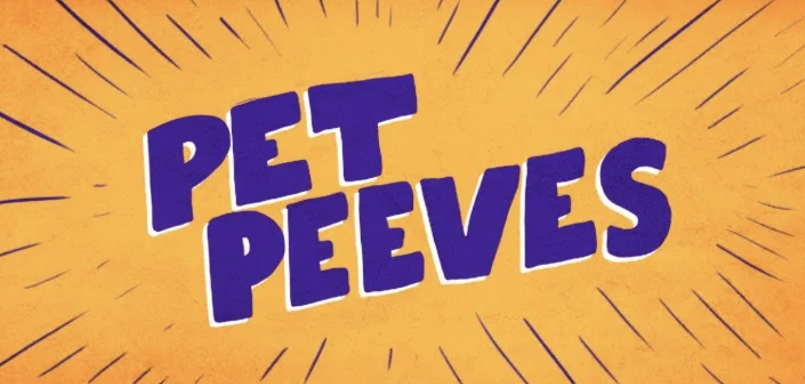

## Dante's Pet Peeve

 

**Who can relate?**

Button that says me!. 
Total count of clicks. 

This is wrong because it is disrespectful to get people’s stuff without asking. Imagine if you are drinking milk and I grab my warm, chocolate chip cookie and dip it in your milk cup without asking you first, how would you feel? Mad, angry, confused, all of the above? Yep, I feel you.
  
Next time you see someone eating people’s food without asking you can do the following: 
Say, “Excuse me, could you please explain what you are doing?”
Yell “Stop, stop, stop!” at the top of your lungs.
Grab their fork and throw it as far aasa you can. 
Have a brief conversation and ask them to tell you what they were about to do - I call this the “honesty test”.
Grab your plate and sit at another table. 

If you think it is acceptable or insignifcant to eat other people’s food from their plate and not ask, please not that this website is intended to help you understand why that is not okay. 

Please don’t grab other people’s food without asking. It is rude. Vey rude. Thanks for tuning in. 

The Moocher.  Related to the food thief, this person is always asking to have or share something – like snacks. But the Moocher freeloads more than food. This person asks to borrow supplies, money for lunch or other favors with no intentions of returning anything. She used to join you and a few of your cohorts for lunch, but now you find yourself sneaking out of the office to avoid the tagalong who will no doubt come up short at the table. The best way to deal with the moocher is to call attention to the offense in a private conversation. Be as diplomatic as possible but state that you can no longer provide favors (give examples) and express how it is a strain on the relationship. Now you have a duty to demonstrate to your teammate that you can remain professional and continue to work with her.

https://www.al.com/business/2014/02/food_thieves_moochers_and_the.html

https://giphy.com/gifs/summerbreak-summer-break-xT0GqfFgIkZfLimRGM

